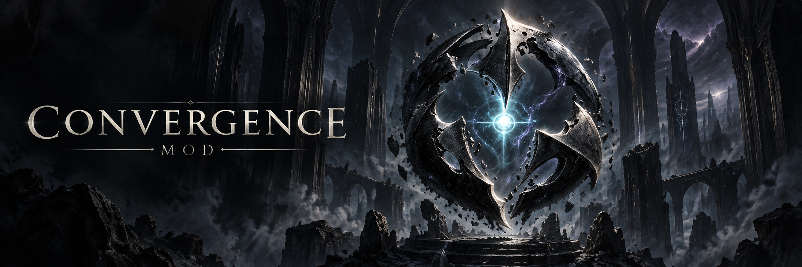

# Convergence Mod



**仲間と挑むRaid。読み切って避けるBoss。Terrariaに、新しい決戦を。**

Convergenceは、Calamity終盤を舞台にした協力Raidと独立Bossを開発するtModLoader Modです。頭割り・散開・蘇生による連携と、予兆を読んで切り抜けるアクションを組み合わせます。

*A Terraria / tModLoader content mod featuring cooperative raids and independent bosses, built around Calamity's endgame.*

[現在の開発状況](docs/STATUS.md) · [開発に参加する](CONTRIBUTING.md) · [環境構築](docs/DEVELOPMENT.md) · [ドキュメント](docs/README.md)

<sub>上の画像はREADME用のイメージイラストです。ゲーム画面ではありません。[制作記録](docs/evidence/2026-09-12-readme-artwork.json)</sub>

## Encounters

| コンテンツ | 体験 | 詳細 |
|---|---|---|
| **不幸な人形劇 / The Unfortunate Doll Play** | ラクリモーサ — 縛られた心に挑む、2～4人推奨の協力Raid。頭割り、散開、DPS区間、味方の蘇生を通じて最終局面へ | [Raid概要](docs/encounters/first-severance/README.md) · [戦闘仕様](docs/encounters/first-severance/ENCOUNTER_SPEC.md) |
| **幽鬼武者 / Ghost Samurai** | 青白い鬼火をまとった二刀流の独立Boss。召喚アイテムから始まり、斬撃の予兆と間合いを読んで戦う | [Boss仕様](docs/encounters/ghost-samurai/ENCOUNTER_SPEC.md) |

本リポジトリは**プレイ可能な開発版**です。実装済みの範囲、最新ビルド、確認済みの挙動と残る試遊項目は [Status](docs/STATUS.md) にまとめています。各Bossの仕様はその機能の文書が持ちます。

Raidの旧称 `First Severance` は、`FirstSeverance` / `first_severance` という内部IDと文書パスに残っています。公開名の変更に伴うコード・セーブ・通信IDの一括改名は行いません。

## Development

| やりたいこと | 最初に読むもの |
|---|---|
| 新しい変更・修正を担当する | [Contributing](CONTRIBUTING.md) と対象機能の仕様 |
| 開発環境を用意する | [Development](docs/DEVELOPMENT.md) → 必要な [Windows手順](docs/runbooks/WINDOWS_DEVELOPMENT.md) |
| 適切な検証を選ぶ | [Verification Matrix](.agents/skills/develop-convergence-raids/references/verification-matrix.md) |
| 設計・API・過去の判断を探す | [作業別の文書案内](docs/README.md#read-by-task) |

新しいcloneでも、ローカルのソースディレクトリ名は `Convergence` を使います。

```sh
git clone https://github.com/Minamium/Convergence-Mod.git Convergence
cd Convergence
python -m pip install -r tools/requirements-ci.txt
python .agents/skills/develop-convergence-raids/scripts/verify_repo.py .
```

これは文書・構成の静的検証です。Modのコンパイルには、[Version Matrix](docs/VERSION_MATRIX.md) のtModLoader・Calamity・.NET環境とローカル設定が必要です。実際のpackage buildは [Windows runbook](docs/runbooks/WINDOWS_DEVELOPMENT.md#diagnose-or-build) の記録付き入口を使います。

## Built for shared development

機能ごとに実装と責任を分け、ゲーム結果はServer / Single Player側で決定します。クライアントは同期された状態から描画・音・UIを組み立てます。

```text
Common/              共有基盤、通信、権限、Raid domain、互換性
Content/Encounters/  各Boss・Raidの実装
Client/              描画、音、UI、アクセシビリティ
Tests/               ゲームに依存しないdomain・codec検証
docs/                現行仕様、開発手順、状態、検証証拠
.agents/skills/      必要な作業で読む開発・調査ガイド
```

共同作業は最新の統合mainから目的別のbranch / worktreeで進めます。共有プレイ用packageの扱いとPRの検証記録は [Contributing](CONTRIBUTING.md#shared-development) を参照してください。

プロジェクトは [Minamium](https://github.com/Minamium) が管理し、[mac10101010](https://github.com/mac10101010) による幽鬼武者の実装など、コントリビューターの協力で開発しています。全履歴は [Contributors](https://github.com/Minamium/Convergence-Mod/graphs/contributors) で確認できます。

## License and credits

ソース・素材の配布ライセンスは未選定です。依頼・合意済みの共同開発、一般からの投稿、公開配布の条件は [Contributing](CONTRIBUTING.md#contribution-scope-and-licensing) と [Release Process](docs/RELEASE_PROCESS.md) に従います。素材・音楽・生成イラストの出典は [Attribution](Assets/ATTRIBUTION.md) に記録しています。
