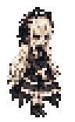

# Convergence Mod



Convergence is a playable development mod for Terraria / tModLoader. It adds a cooperative raid and an independent boss, with combat tuned around Calamity's endgame equipment. The raid combines bullet dodging with group mechanics, a shared arena, and teammate revival.

[Steam Workshop](https://steamcommunity.com/sharedfiles/filedetails/?id=3798073077) · [GitHub Releases](https://github.com/Minamium/Convergence-Mod/releases) · [Current status](docs/STATUS.md) · [Contributing](CONTRIBUTING.md) · [Documentation](docs/README.md)

## Content

- **Requiem of the Hollow Doll — initial prototype complete.** A raid against **Lacrimosa — The Bound Heart**, recommended for 2–4 players. Fight through multiple phases using coordinated Stack and Spread mechanics, damage windows, and instant teammate revival. Survive the final sequence to earn weapon reward boxes. Balance and compatibility remain provisional. [Raid guide](docs/encounters/first-severance/README.md) · [Combat specification](docs/encounters/first-severance/ENCOUNTER_SPEC.md).
- **Ghost Samurai — in development.** An independent dual-wielding boss with travelling slash waves, dash attacks, lattice patterns, and wisps. It uses its own summon and normal player death, not the raid's Ready or revival system. Rewards, balance and lifecycle work remain unfinished. [Boss specification](docs/encounters/ghost-samurai/ENCOUNTER_SPEC.md).

This is a public playtest, not a finished or stability-certified release. **Solo activation is available**, but multiplayer testing is preferred; the fight is not rebalanced for solo and companions do not replace raid participants. Back up worlds and characters, and expect intense flashes, screen shake and sound. Reduced-effects settings are available. The [status page](docs/STATUS.md) owns verification and known issues, including the Ghost Samurai shutdown exception that can occur without summoning that boss.

## Requirements and starting a raid

Use the supported tModLoader version and dependency versions in the [version matrix](docs/VERSION_MATRIX.md). **Calamity Mod and Luminance are required**, together with the dependencies requested by tModLoader. Recommended equipment is Calamity endgame gear. Client and server must run matching Convergence builds and protocols.

The three setup items currently have no normal recipes. Obtain **Foundation Core**, **Theater Doll** and **Resuscitation Kit** through an item browser/spawner such as Cheat Sheet (a setup aid, not a dependency).

1. Place a **Foundation Core** pedestal with enough unobstructed arena space.
2. Hold the **Theater Doll** activation item and click the pedestal to deploy preparation. This item is separate from the summon weapon and is not consumed.
3. Every admitted player must mark **Ready**. The raid starts after everyone is ready.

See [arena setup](docs/ARENA_INFRASTRUCTURE.md) for placement/admission rules and [recovery](docs/encounters/first-severance/REVIVE_SPEC.md) for Down and revival behavior. Ordinary gameplay and Reload checks are distinct from successful compilation.

The raid's former name, `First Severance`, remains in stable code, asset, packet, and document identifiers. Its public rename does not migrate saved items or network IDs.

## Development

Clone into a source directory named `Convergence`:

```sh
git clone https://github.com/Minamium/Convergence-Mod.git Convergence
cd Convergence
python -m pip install -r tools/requirements-ci.txt
python .agents/skills/develop-convergence-raids/scripts/verify_repo.py .
```

This runs repository checks, not a Mod build. Follow [Development](docs/DEVELOPMENT.md) and the [Windows runbook](docs/runbooks/WINDOWS_DEVELOPMENT.md#diagnose-or-build) to configure local dependencies and produce a recorded package. Choose checks by change type using the [verification matrix](.agents/skills/develop-convergence-raids/references/verification-matrix.md).

```text
Common/              Shared infrastructure, networking, authority, domain, compatibility
Content/Encounters/  Encounter-specific gameplay
Client/              Rendering, audio, UI, accessibility
Tests/               Terraria-independent domain and codec checks
docs/                Specifications, workflow, status, evidence
.agents/skills/      Task-specific development and research guidance
```

Work from integrated main in a scoped branch or worktree. Shared play packages follow the [integration workflow](CONTRIBUTING.md#shared-development). Game outcomes remain server/Single Player authoritative, with only the explicitly documented [Ghost Samurai native-wave exception](docs/adr/0023-ghost-samurai-native-wave-damage.md).

## Reports and releases

Report reproducible issues through [GitHub Issues](https://github.com/Minamium/Convergence-Mod/issues). Include the Mod/tModLoader versions, single-player or multiplayer mode, relevant enabled Mods, reproduction steps, and a short relevant log excerpt. Remove personal paths, names, chat, and credentials; do not upload saves or full raw logs by default.

The 0.3.1 public-test candidate and its limits are described in [release notes](docs/releases/0.3.1.md). GitHub packages and Workshop uploads are separate; check the installed version and keep every multiplayer peer on the same build. Historical player feedback is [optional, searchable history](docs/history/PLAYTEST_FEEDBACK.md), not a development reading requirement.

## License and credits

Maintained by [Minamium](https://github.com/Minamium), with contributions including Ghost Samurai by [mac10101010](https://github.com/mac10101010). See [contributors](https://github.com/Minamium/Convergence-Mod/graphs/contributors) for the project history.

**Music: EigHt — 不幸な人形劇.** [Original work](https://booth.pm/ja/items/5206457) · [Creator's video](https://www.youtube.com/watch?v=vTFL5_d_p7o) · [Use terms](https://eight-novel.fanbox.cc/posts/7647818). The in-game phase edits use this music as background for the Mod; it is not a project-original composition or a separately redistributable soundtrack. No endorsement by the composer or Calamity team is implied.

The owner distributes the compiled development Mod for playtesting. No general open-source or standalone asset-reuse license is granted; existing rights are retained by the respective creators. Public repository access is not permission to reuse or redistribute individual assets. Agreed collaboration and distribution follow [Contributing](CONTRIBUTING.md#contribution-scope-and-licensing) and [Release Process](docs/RELEASE_PROCESS.md). Music and other asset sources/conditions are recorded in [Attribution](Assets/ATTRIBUTION.md).
