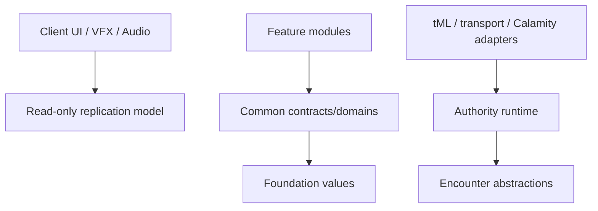

# Architecture

## Objective

Build a multiplayer-first Calamity addon that can grow from one post-Exo Mechs/Supreme Calamitas Raid into multiple Bosses, Raids, items, World features, and presentation systems without making the first Raid or Calamity integration a permanent global dependency.

The architecture is a modular monolith: one tModLoader assembly with enforced source boundaries. Assembly splitting happens only when demonstrated ownership/build needs justify it.

## Current implementation note

The source contains a First Severance development experiment composing the loop and revive domains. [Status](STATUS.md) is authoritative; [ADR-0009](adr/0009-development-combat-experiment.md) distinguishes its temporary NPC/HP adapter from the unfinished production hit/death/Barrier integration. The product loop remains in the [First Severance spec](encounters/first-severance/ENCOUNTER_SPEC.md).

## Dependency direction



| Layer | May depend on | Must not depend on |
|---|---|---|
| `Common/Foundation` | .NET primitives | Terraria, Calamity, Content, Client |
| `Common/Encounters/Abstractions` | Foundation/.NET | Runtime implementation, tML, feature, presentation |
| `Common/Encounters/Runtime`, `Common/Raids` | abstractions and narrow ports | feature names/behavior, UI/audio |
| `Common/Networking` | Foundation, commands, replicas, tML transport | feature behavior switches |
| `Common/Compatibility/<Mod>` | tML and named dependency | Content/presentation |
| `Content/Encounters/<Feature>` | Common | Client or unrelated features |
| `Client` | read models and cue contracts | authority mutation |

Repository checks provide a coarse import guard; review remains responsible for indirect coupling.

## Composition root and feature registration

`ConvergenceMod` owns Mod identity/load/unload and delegates packet input. It does not contain encounter selection, balance, recipes, or UI.

Feature-local `ModSystem` code registers immutable `EncounterDefinition` objects. A definition supplies its key, participant bounds, feature-scoped activation policies, and runtime factory. Adding an encounter must not add a switch to the global coordinator/router.

Current-to-target migration:

```text
FirstSeveranceRegistrationSystem (current inert code)
  -> EncounterCatalogSystem.Registry
  -> FirstSeveranceDefinition
  -> FirstSeveranceRuntimeFactory
```

## Generic encounter foundation

Common currently owns:

- `FightId`, `ParticipantId`, and tile-space value objects;
- encounter definition registry and legal lifecycle transitions;
- one authoritative managed session per World;
- typed start command and activation-policy boundaries;
- runtime update/factory/partial-construction cleanup contracts;
- World-monotonic Encounter Sequence, live/terminal snapshots, bounded/coalescing outbox;
- replica ordering/tombstones and packet envelope/direction guard;
- isolated Calamity compatibility/version gate;
- pure Raid Downed/Revive domain under `Common/Raids/Revive`.

It intentionally does not own a general mechanic DSL, feature phase graph, Boss AI, UI/audio, arbitrary World events, or persisted active fights.

## Lifecycle and state decomposition

```text
Idle projection -> Validating -> Preparing -> Active -> [optional Resolving] -> End -> Cleanup -> Idle
```

`EncounterRuntimeUpdate.End(termination)` may enter Cleanup directly from a live state. `Resolving` is an optional separately ticked stage, not a mandatory terminal waypoint and not something a runtime can request together with End in one update. First Severance's initial slice stores its feature terminal cause in that descriptor and uses direct End; a future reward/result ceremony may specify `Active -> Resolving` on one tick and `Resolving -> End` later.

The coordinator End boundary carries a feature-neutral immutable termination descriptor containing the generic reason plus bounded feature schema/version/cause data. Every definition owns a constructor-validated immutable mapping for `WorldUnload`, `InternalFailure`, and `ProtocolFailure`. Runtime-owned endings supply a contract-validated descriptor directly; coordinator Reset, exception, and queued fatal-protocol paths synthesize it from definition data without re-entering failed mutable logic. External shutdown preempts an uncommitted feature update, then the combined terminal projection is published before cleanup. A runtime-creation failure happens before session acceptance, uses the mapped descriptor only for partial-construction cleanup, and creates no live tombstone.

`EncounterSession` is decomposed rather than a global state bag:

```text
Identity     Encounter Sequence, Fight ID, definition/protocol/schema
Lifecycle    state, revision, end reason, authority tick
RaidRoster   stable Participant ID, player slot, connection epoch, Ready
Arena        Core identity, bounds, validation, Barrier
Feature      substate, loop, Overload, assignments, Boss/Pylon state
Revive       Downed/Alive/Eliminated, tokens, channels, deadlines
Ownership    compact token to NPC/Projectile/resource registry
```

NPC `ai[]`, Tile Entities, `ModPlayer`, and UI are adapters/projections, never the whole Raid's source of truth.

## Authority split

Server or Single Player local authority alone decides:

- lifecycle, roster, bindings/epochs, Ready, phase ticks, random assignments;
- actor spawn, hit/damage checks, Boss life/gate, Pylon result;
- Stack/Spread result, Downed/Revive, Overload, victory/Defeat;
- exact-Fight ownership, terminal snapshot, and cleanup.

Clients submit bounded input and render snapshots/cues. Barrier movement may be predicted and telegraphs interpolated, but the server corrects position/results. Audio/particles/camera cannot control gameplay time.

## Runtime and cleanup ownership

`EncounterCoordinatorSystem` creates/ticks mutable authority only in Single Player or server mode. A runtime returns `EncounterRuntimeUpdate`; it does not reach back through a global coordinator.

Each feature runtime registers every transient resource immediately. Construction failure, tick exception, user cancel, Defeat, Victory, Foundation Core Tile/TE loss, Boss loss, and World unload converge on the same cleanup boundary. Feature-observed terminal candidates are reduced inside the runtime; World unload, an unhandled tick exception, and a fatal protocol decision are coordinator-owned preemptions delivered through the termination descriptor rather than fake feature commands. Cleanup:

1. validates the exact expected Fight ID;
2. stops transitions/spawns and commits terminal state;
3. publishes the final snapshot/outcome;
4. removes owned actors/projectiles/assignments/Barrier;
5. restores or normalizes participant projections;
6. clears revive channels/reservations and Core busy state;
7. releases session state in `finally`;
8. retains failed cleanup participants for retry and blocks new encounters until resolved.

The same exact-Fight cleanup can be called repeatedly; stale-Fight cleanup never releases a different current session.

## First Severance feature boundary

`Content/Encounters/FirstSeverance` will own the simple Boss, Pylons, active-loop executor, typed tuning, mechanics, arena adapters, and feature snapshot. Ring/arms are presentation components of one Boss NPC. Pylons are separately owned NPCs.

The current `FirstSeverance` immutable plan owns only SpawnIntro, PylonCheck, Stack, Spread, CoreExposure, and Reset. Its bounded high-level state machine, timings, roster-scaled counts, Overload/cap policy, and append-only terminal causes stay feature-local; do not generalize them into a mechanic DSL.

## Downed and Revive boundary

`RaidReviveService` is a pure authority state machine composed after the frozen Raid roster exists. It owns Downed deadlines, stable participant/binding validation, batched revive arbitration, exact channel leases/nonces, token reservation/consumption, reconnect grace, end-of-tick wipe evaluation, bounded snapshots/projections, and cleanup.

Terraria adapters remain narrow:

- authority death hook submits eligible lethal events;
- `ModPlayer` applies control/targeting/life projections and reports authoritative interrupts;
- transport derives sender from `whoAmI` and forwards bounded target/nonce input;
- feature replication carries read-only revive state/events.

The pinned tModLoader/Calamity death-hook interaction is a blocking compatibility spike. Do not connect it by bypassing evidence.

## Persistence

Active Encounter/Raid state is ephemeral and is not resumed after World load. Only future stable progression/settings may use versioned tModLoader World/Player save schemas. A new persistence design requires an ADR. The documentation catalog/database is unrelated to runtime game state.

## Calamity boundary and independence

Stage A keeps the hard dependency but only `Common/Compatibility/Calamity` touches its APIs/types. Feature code consumes project-owned concepts. Stage B formalizes portable ports; Stage C adds original progression/content and removes the hard reference only after a separate matrix. Never copy/vend Calamity source, binaries, or assets.

## Extension rule

Extract a Common abstraction only when a second concrete feature requires it and both use cases fit without feature flags. Changes to authority, module direction, protocol compatibility, persistence, external dependencies, or asset rights require a new ADR rather than silent edits.
