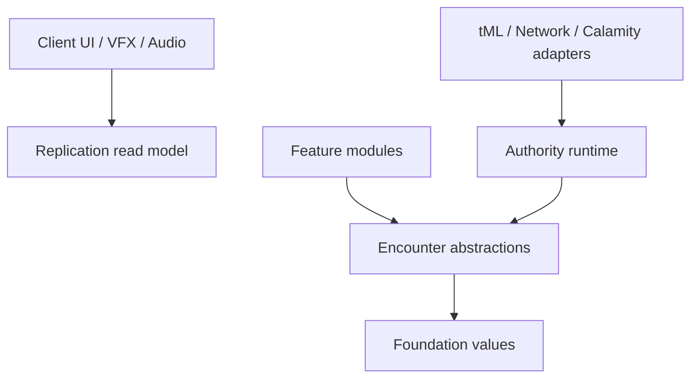

# Architecture

## Objective

Build a multiplayer-first Calamity addon that can grow from one post-Exo Mechs/Supreme Calamitas Raid into multiple bosses, encounters, items, world features, and presentation systems without making the first Raid a global dependency.

The architecture is a **modular monolith**: one tModLoader assembly with enforced source boundaries. This keeps the initial build and reload workflow simple while preserving seams that can become separate assemblies only when scale justifies it.

## Dependency direction



Allowed dependencies:

| Layer | May depend on | Must not depend on |
|---|---|---|
| `Common/Foundation` | .NET primitives | Terraria, Calamity, Content, Client |
| `Common/Encounters/Abstractions` | Foundation and .NET primitives | Runtime implementation, tML, specific encounters, presentation |
| `Common/Encounters/Runtime` / future `Common/Raids` | Encounter abstractions and narrow ports | specific encounters, UI, audio |
| `Common/Networking` | Foundation, runtime commands, read-only replicas, tML transport | specific encounter behavior |
| `Common/Compatibility` | tML and the named dependency | Content, presentation |
| `Content/<Feature>` | Common | Client and unrelated content modules |
| `Client` | replication read models and feature cue contracts | authoritative mutation |

`tools/repository_checks.py` rejects direct `Common -> Content/Client`, `Content -> Client`, `Encounter Abstractions -> Runtime/Networking/tML`, and `Encounter Runtime -> Networking` imports. This is a coarse guard; review still checks indirect coupling.

## Composition root

`ConvergenceMod` is intentionally small. It owns Mod load/unload identity and delegates packets to the common router. It does not contain encounter selection, balance data, recipes, or UI state.

Feature modules register immutable `EncounterDefinition` objects through their own `ModSystem`. A definition supplies feature-scoped activation policies and an `IEncounterRuntimeFactory`, so adding an encounter must not require a switch statement in the packet router or coordinator. Global policies are reserved for cross-cutting authority and compatibility checks.

Current example:

```text
ThirdSeveranceRegistrationSystem
  -> EncounterCatalogSystem.Registry
  -> ThirdSeveranceDefinition
  -> ThirdSeveranceRuntimeFactory
```

## Common encounter foundation

The common foundation currently owns:

- `FightId`, `ParticipantId`, and tile-space geometry value objects;
- immutable encounter definitions and their registry;
- legal lifecycle transitions;
- one authoritative active session per World;
- typed start commands and activation policies;
- runtime update, factory, partial-construction cleanup registrar, and cleanup contracts;
- World-monotonic Encounter Sequence, live/terminal snapshots, a bounded terminal-priority/coalescing outbox, and read-only replica ordering/tombstones;
- a versioned packet envelope and direction validation;
- the Calamity version compatibility boundary.

It deliberately does **not** yet own:

- a general mechanic DSL;
- phase scripting;
- arbitrary world events;
- UI or sound playback;
- Boss AI;
- persistence of active fights.

Those abstractions will be extracted only after the first implementation supplies concrete requirements.

## Runtime ownership

`EncounterCoordinatorSystem` is the tModLoader hook adapter. It creates and ticks `EncounterCoordinator` only in Single Player or on the server. A multiplayer client never receives a mutable authoritative coordinator.

The coordinator owns at most one managed Boss/Raid `EncounterSession` per World in the initial architecture. This exclusivity does not claim ownership of arbitrary vanilla or third-party NPCs; activation policies must reject conflicting World activity. Each session owns exactly one feature runtime and releases it through a reverse-order cleanup scope. Factory-created resources can register immediately, so partial construction failures are covered. Failed cleanup participants are retained in a retry backlog and block the next managed encounter. Creation failures, runtime exceptions, cancel, wipe, Core destruction, and World unload converge on that same boundary.

Feature runtimes return `EncounterRuntimeUpdate` from `Tick`; they do not reach back into a global coordinator. The update may request a legal generic lifecycle transition, a terminal reason, or one observable revision. Raid-specific state remains decomposed instead of becoming one global bag:

- session identity;
- roster and stable participant IDs;
- arena state;
- phase state;
- mechanic state;
- owned entity registry;
- outcome and cleanup state;
- feature-specific snapshot payload.

NPC `ai[]`, Tile Entities, `ModPlayer`, and UI are projections or adapters, not the source of truth for the whole Raid.

## Server and client split

Server/SP authority decides lifecycle, roster, assignments, timers, random results, actor spawn, damage checks, Downed/Revive, and victory. Clients submit bounded requests and render snapshots/events. `EncounterReplica` can only accept or reset snapshots; it orders `(EncounterSequence, Revision, AuthorityTick)` and retains a terminal tombstone so delayed older fights cannot revive.

Client-only systems may predict movement against the Barrier and interpolate telegraphs. The server corrects final positions. Audio, particles, trails, subtitles, and screen effects never control gameplay clocks.

## Encounter versus Raid versus World Event

`EncounterDefinition` is the smallest common catalog entry for a normal Boss or Raid. Its generic lifecycle is `Validating -> Preparing -> Active -> Resolving -> Cleanup`. Raid-only concepts such as Ready, roster, revive tokens, and coordinated mechanics will live under `Common/Raids` or the owning Raid feature as substates of `Preparing`/`Active`; they are not generic lifecycle values.

Long-running invasions or world events will receive a separate coordinator. They may reuse identifiers, transport, ownership, and diagnostics, but they will not be forced through the Raid lifecycle.

## Compatibility boundary

Only `Common/Compatibility/Calamity` may call Calamity APIs or reference Calamity types. Initial integrations prefer documented `Mod.Call` contracts with explicit result type checks. Reflection, IL patches, publicizers, copied Calamity code, and reliance on private fields are out of scope.

Unsupported Calamity versions disable encounter activation rather than allowing an untested fight to mutate World state.

## Persistence policy

An active session is ephemeral. Save/load does not resume a fight. World unload always performs cleanup, and the next load begins Idle. Future permanent progression flags and configuration receive independent schema versions; protocol, save schema, and Mod version are not coupled.

## Extension recipes

### Add another Raid

1. Create `Content/Encounters/<Name>/`.
2. Define an immutable `EncounterDefinition` and registration system.
3. Add its Raid session factory, arena profile, phase plan, and feature snapshot codec.
4. Keep NPCs, projectiles, tiles, rewards, and tuning within that module.
5. Extract shared mechanics only after a second encounter uses them.

### Add a normal Boss

Use an Encounter definition without Raid roster/Ready/Revive services. It still participates in the initial one-managed-encounter exclusivity policy. Reuse ownership, diagnostics, and snapshot infrastructure where useful.

### Add shared combat behavior

First implement it inside the owning feature. Move it to `Common/Combat` only when its API can be described without feature-specific names or assumptions.

## Architecture change rule

Changes to dependency direction, authority, protocol compatibility, persistence, external dependencies, or asset rights require an ADR. Accepted ADRs are superseded by new records rather than silently rewritten.
